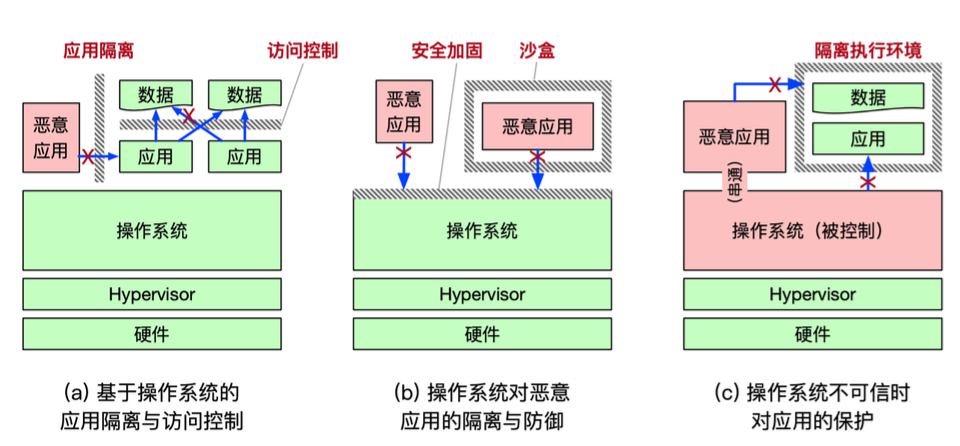

# OS Review

## Security

### 安全层次

### 概念

- 可信计算基：为实现计算机系统安全保护的所有安全保护机制的集合。包括软件、硬件和固件（硬件上的软件）
- 攻击面：一个组件被其他组件攻击的所有方法的集合；可能来自上层、同层和底层。
- 防御纵深：为系统设置多道防线，为防御增加冗余，以进一步提高攻击难度。

### 认证和授权

认证：确定发起请求实体的身份；授权：确认实体所拥有的资源访问权限。

### 侧信道与隐秘信道

* 隐秘信道：原本无法直接通信的双方，通过原本不被用于通信的机制传输数据。
* 侧信道：攻击者通过被攻击者无意泄露的信息窃取数据。

### 硬件飞地（Enclave）

在 OS 都不可信的情况下，必须有一块净土（飞地）作为可信基来保证安全。

Enclave 仅仅信任 CPU 的计算逻辑及其 Cache。

#### Intel SGX

以 CPU 外壳为界；以外的信息都是秘文，以内的信息（包括 Cache 和寄存器）都是明文。

数据进出 CPU 时，SGX 进行加密解密操作。

#### Merkle Hash Tree

Merkle Hash Tree 可以保护内存完整性。

对内存中的数据计算一级 Hash，一级 Hash 计算出二级 Hash，构成树状结构。终极 Hash 存在 CPU 中。

在读取内存时，一级一级地求 Hash 验证完整性。

> 当然，这里的内存都只可能是物理内存；因为页表是受不可信的 OS 控制的，可能恶意映射。

Merkle Hash Tree 可以保证内存不受到拼接、欺骗攻击。但是无法防御重放攻击；如果同时把所有的 Hash 替换成老版本，就能骗过验证。

因此，我们把最高级的 Hash 信息存在 CPU 里，以避免回放攻击。

