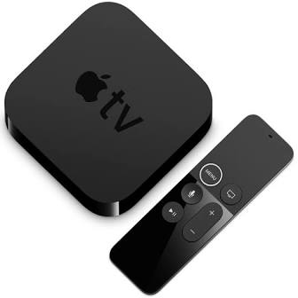

# SE-340

## Assignment 1

### Companies

#### Alphabet (U.S.A.)

##### Business

* 搜索引擎
  * Google
* 移动操作系统
  * Android
  * Chrome OS
* 消费级应用
  * Gmail 电子邮件
  * Google Play 应用市场
  * Google Docs 文稿处理
  * Google Maps 地图
  * Google Chrome 浏览器
  * Google Translate 翻译
  * Google Drive 云盘
  * YouTube 在线视频
* 云计算
  * Google Cloud Platform
* 广告技术
* 硬件
  * Google Pixel 系列手机
  * Chromebook 笔记本
  * Google Glass 智慧眼镜

##### Profiting

Google 的伞形母公司 Alphabet 仅在 2019 第三财年就创造了 404.9 亿美元的收入。其中，超过八成的收入来自其广告业务。

##### History

在 Google 成立的早期（1996 年至 1999 年），公司的收入基本来源于天使投资；业务仅限于纯粹的搜索引擎。

直到 2000 年，Google 推出了广告平台 AdWords，标志着其进入了广告投放市场。在随後的十年内，又相继推出了 Adsense、UAC，收购了广告服务类公司 DoubleClick、Admob 等为自家的广告业务助力。Google 的推广业务也不负众望，成为了 Google 最赚钱的业务。

可以说，Google 在其他方面的大胆创新、技术精进，烧的都是广告业务的钱。

##### Technologies

Google 的技术积累和其广泛的业务联系紧密。其成熟的技术门类包括：

###### 搜索引擎相关的

* 计算机爬虫
* 自然语言分析
* 大规模数据存储

###### 翻译相关的

* 自然语言分析

###### 广告投放相关的

* 大数据用户画像

###### 浏览器相关的

* 浏览器渲染内核
* Web 标准影响力

###### 操作系统相关的

* 中间码虚拟机解释技术
* GUI 交互技术
* Material 设计语言
* 内置 App 广告投放

##### Researches

以下这些是来自于一些尚处于实验阶段，尚未投入实际业务的技术。在 Google 重组为 Alphabet 之后，这些业务大多被剥离为独立的公司，包括：

###### Jigsaw

主要掺和地缘政治。

发布了基于 Shadowsocks 轻量代理技术的 Outline，采用代理服务器绕过互联网审查和封锁。

> 主要针对 P.R. of China 和 I.R. of Iran 的网络封锁。

本身没有什么新颖的技术，Outline 也只是基于 `shadowsocks-libev` 的套壳。

###### DeepMind

主攻人工智能研究。

最有名的围棋 AI AlphaGo 就出自于 DeepMind 之手。

主要技术包括：

* 人工智能
* 深度学习
* 医学模型

> 最近，DeepMind 医学部给出了一个关于 COVID-19 的蛋白质结构预测模型。

公司几乎不赚钱，Alphabet 每年给 DeepMind 的输血超过 5 亿美金。但其大部分试验性的「车库技术」后续都被并入公司内其他部门，可以说是 Google 的创新工厂。

###### Loon

致力于使用气球提供廉价的互联网连接。

目前的互联网接入主要依赖有线光纤，成本高，受地面条件限制大。

如果采用空中飞行物气球🎈来为偏远地区提供互联网连接，成本能够大大降低，可靠性、可维护性也能提高。

主要研究方向包括：

* 互联网协议
* 信息传输学
* 空气动力学
* 航空航天学

###### Waymo

主要关注自动驾驶技术。

主要研究方向包括：

* 人类行为学
* 计算机视觉
* AI 辅助驾驶

#### Apple (U.S.A)

和 Google 不同，Apple 的所有技术积累和研究方向，最终都是为了零售用户的体验。Apple 也不涉及广告业务，盈利主要来自终端设备的销售，以及部分订阅制软件。

因此，我们可以按照其产品线来分别分析 Apple 的技术积累。

##### PC & Mac (Classic)

早期计算机，指的是自 Apple I 直至最後一代使用 PowerPC 架构的 Mac 为止的所有 Apple 电脑。

早期 PC 和 Mac 的软件均由 Apple 自行开发。

这一系列产品所用的操作系统包括：

* Wozniak's BASIC
* Lisa OS
* NeXTSTEP OS
* Old Mac OS (till `9.x`)

随着时代演进，这些软件所用的技术几乎都已被时代淘汰。

##### PC & Mac

後期计算机，指的是在转用 Intel 架构之後所推出的 Mac 系列电脑。

这一系列产品所用的操作系统包括：

* Mac OS X (`10.0` ~ `10.11.x`)
* macOS (`10.12+`)

系统基于 FreeBSD 魔改而成的 Darwin 内核，符合 POSIX 标准。

软件方面的技术主要包括：

* GUI 设计
* 自然交互
* 语音识别

硬件方面的技术主要包括：

* Retina Display
* Force Touch

没有什么特别突出的地方。

##### iPod (Classic)

指早期未采用 iOS 系列系统的 iPod。

硬件方面，iPod 将大容量硬盘装入移动设备中；初代 iPod 的转盘式设计也非常实用。

然而如今这些技术几乎都被替代了。

##### iDevice

主要指 iPod touch 系列随身听、iPhone 系列手机、iPad 系列平板电脑等采用 iOS 和 iPadOS 操作系统的设备。

其中，相较于其他同类产品的特点包括：

* 120 Hz 刷新率屏幕
* A11 - A13 仿生芯片
* 广色域屏幕

其中，A11 - A13 系列仿生芯片内置了人工智能模块，大大提升了 AI 算力。

芯片上用到的技术主要包括：

* 人工智能
* 深度学习
* 微电子芯片设计
* 集成电路设计
* 计算机图形学

由于该芯片的技术不对外公开，因此无法得到进一步明确的资料。

##### Apple Watch

可穿戴运动、医疗辅助智能手表。

最新版本的功能包括：

* 窦性心率、心率变异性侦测
* 心电图功能

> 此项功能由于医疗器械审批制度而在国内被禁用。

* 运动追踪

其中至少用到了以下技术：

* 计算机辅助医疗
* 计算机辅助运动
* 生物电学

##### Apple TV

家庭娱乐、电视机顶盒。

特色功能是高画质输出，同时具有极其简单的操作界面和方式方法。

功能强大全面，同时只需要一个简单的遥控器即可自然操作。

用到的技术主要包括：

* 人机交互方式方法
* UI 设计
* 体感追踪

##### Siri

同 iOS 6 打包发布的个人语音助理软件。

主要技术亮点包括：

* 知识引擎搜索
* 自然语言识别
* 语音转文字（STT）
* 文字转语音（TTS）

##### ARKit

同 iOS 11 打包发布的虚拟现实 SDK。

主要技术亮点包括：

* 虚拟现实
* 空间重建
* 混合现实

> 还是那句话，Apple 的技术探索都是为硬件设备服务的。因此，在对应的设备发布之前，也没有官方消息得知其探索中的最新技术。

#### Microsoft (U.S.A.)

微软的业务同时面向企业和一般消费者。

> 遗憾的是，Microsoft 对于消费者服务极为不走心，常常三分钟热度；动不动就开新业务，而不流行的业务说砍就砍。

##### Windows (Desktop)

Windows 自 1985 年发布以来，经过长时间演进，已经成为最流行的桌面操作系统。同时也因为自打采用 Windows NT 内核以来，一直没有进行完整的现代化的革命，导致其内部目前多种设计语言、设计风格并存，许多上古残片仍然留存在最新系统中。这都是为了保证「向下兼容性」。

技术亮点包括：

* GUI 设计
* 人机交互技术

##### Windows Phone

在 21 世纪初期 PDA 流行的时候，Windows Mobile 就推出了首个版本；后来在 Windows Phone 7 转型不力，Windows Phone 8 朝令夕改抛弃老用户和开发者之后，终于成功在 2019 年被停止所有更新，开发人员改组，WP 寿终正寝。

##### Xbox

微软推出的家用游戏设备；最早是为了推广自家的 DirectX 引擎而推出的游戏盒子；后来和 Sony 的 PlayStation、Nintendo 三分家用主机天下。

主要技术亮点包括：

* GUI 设计
* 人机自然交互
* 语音识别
* 计算机图形学

##### HoloLens

是微软在 2014 年末发布的可穿戴增强现实头盔。卖的死贵还没保修。

主要技术亮点包括：

* 空间重建
* 增强（混合）现实
* 可穿戴设备
* 自然手势交互处理
* GUI 设计

##### Microsoft Band

跟风 Apple Watch 推出的可穿戴设备。由于用户数量过少，在 2018 年停产，并关停软件服务器。

主要技术亮点包括：

* 生命体征测量
* 运动监测
* 可穿戴设备
* 人机自然交互

##### Microsoft Azure

面向企业的云服务。其业务广泛，包括：

* 自动化测试/集成部署服务 Azure Pipelines
* 语音识别服务
* 自然语言识别服务
* 光学字符识别（OCR）服务
* 深度学习模型训练服务

用到的技术包括：

* 计算机图形学
* 计算机视觉
* 硬件资源虚拟化
* 人机自然交互服务
* 人工智能、深度学习

#### Samsung (R.O. Korea)

Samsung 的业务十分广泛，其中三星电子的主要业务包括消费级硬件生产；其余业务还包括 OLED 屏幕制造、移动 SoC 设计、内存颗粒生产等等基础硬件业务。

##### Mobile Phones

自 2010 年以来，Samsung 就开始推出「双旗舰」系列手机 Galaxy S 和 Galaxy Note。虽然 Galaxy Note 7 手机电池设计缺陷导致的安全问题引发了公关危机和全球恐慌，但手机生产仍然是 Samsung 最重要的业务之一。

主要技术点包括：

* 人机交互方式方法
* GUI 设计
* OS 开发

##### Bixby

类似于 Apple Siri 的智能语音助手，同 Samsung Galaxy 系列手机搭载推出。

主要技术点包括：

* 人类语音识别
* 自然语言识别
* 知识引擎搜索
* 文字转语音（TTS）

##### OLED Screen

三星的 AMOLED 屏幕全球知名，不仅用于自身的旗舰手机 Galaxy 系列，还被其他公司的旗舰产品所采用。

主要技术点包括：

* 人类视觉学
* 计算机图形学
* 集成电路设计

##### DRAM

三星 DRAM 芯片始终紧跟最新技术。就在 2020 年 3 月 9 日，三星最新的 DRAM LPDDR4X 正式开放市场流通。

主要技术点包括：

* 集成电路设计

#### Facebook (U.S.A.)

和 Google 类似，Facebook 是一家软件起家，广告立司的公司。同样和 Google 类似，Facebook 无法进入中国大陆市场。

##### Advertisement

Facebook 的盈利模式更为恐怖；不像 Google 还有一部分微弱的软硬件业务可以变现，Facebook 的广告收入占到了总收入的 $98\%$。除此之外基本没有其他业务。

##### Researches

Facebook 的创新技术研究也主要在软件方面。

* PyTorch
  * 深度学习框架平台
* React
  * 流行的网页前端开发框架
* React Native
  * 跨平台移动软件开发框架

#### Amazon (U.S.A.)

Amazon 始于一个在线电商平台。

##### Amazon 购物平台

##### AWS

Amazon 提供的云计算服务。包括云主机计算、深度学习训练等功能。

主要技术点包括：

* 硬件资源虚拟化分配
* 深度学习加速算法

##### IMDb

基于 Amazon 的艺术作品评级网站。

> 可以搞艺术 但是没必要

网站本身没有什么技术亮点。只不过名气大，数据全。

##### Alexa

类似于 Apple Siri 的在线语音回馈服务，同 Amazon Alexa 音箱一同推出。

主要技术点包括：

* 人类语音识别
* 自然语言识别
* 知识引擎搜索
* 文字转语音（TTS）

### Imaginations

假设这些尚在试验阶段的技术全部成为现实。那么，我设想未来的世界运作模式会是这样：

#### Economies

经济方面，实体制造业本身会进一步萎缩，而基于实体制造业的广告业会进一步增长，直到二者达到一个几乎平衡的状态：制造业本身和宣传制造品的广告业达到动态平衡。

更多的资源被耗费在宣传和广告之中。

同时，更多的低创造性工作岗位将被人工智能和深度学习训练的软件取代。

#### Politics

随着社交媒体渗透到所有人的生活之中，具有政治倾向性的引导越来越容易。

最近，Facebook 就因设计 Trump 和 Biden 的政治广告风波遭到抵制、起诉，遇到一系列麻烦。剑桥分析公司也因 2016 年美国大选干涉问题被推向风口浪尖。

可以看出，各家科技公司在发展到一定程度之後，早早晚晚会往政治方向扩展；这也是因为政治生活在传统的西方世界生活中占有重要地位。而随着人工智能推荐算法的日渐完备，进行政治倾向性引导未必需要再借助硬广告；只需要暗中平衡推送信息的风格和倾向就能轻易实现公众情绪的引导。

因此，预测在未来世界的其他国家里，政治生活将会极大地受到技术的干预和影响，而且很可能是隐性的。

#### Entertainment

技术再怎么美好进步，总归也需要成为产品才能盈利；对于所有公司来说，盈利才是终极追求目标。

而对于简单人来说，计算机所提供的技术是最为低成本、最无条件的娱乐方式；可以预见在将来很长一段时间之内，娱乐至上将会是人类社会追求的主流。或许会持续直到能源枯竭之时。

#### Culture

目前的计算机相关技术还没有到能登「文化」大雅之堂的地步。

但是随着和计算机技术一同长大的一代人成为社会主流，或许计算机技术会成为像是交流电、纯净水一样自然的物件；到了那时，或许文化中也会有计算机的一席之地。

## References

1. Google Website (Hong Kong), https://www.google.com.hk
2. Alphabet Website, https://abc.xyz
3. Jigsaw Outline Repository, GitHub, https://github.com/Jigsaw-Code/outline-client
4. DeepMind Website, https://deepmind.com
5. Loon Website, https://loon.com
6. Computational predictions of protein structures associated with COVID-19, DeepMind, https://deepmind.com/research/open-source/computational-predictions-of-protein-structures-associated-with-COVID-19
7. Apple Website, https://www.apple.com
8. Microsoft Website, https://www.microsoft.com
9. What is AMOLED?, Samsung, https://www.samsung.com/global/galaxy/what-is/amoled/
10. Samsung Semiconductor Global, https://www.samsung.com/semiconductor/dram/lpddr4x/
11. Facebook Website, https://www.facebook.com/login.php
12. Facebook GitHub Page, https://github.com/facebook
13. Amazon Developer Website, https://developer.amazon.com/en-US/alexa
14. AWS, Amazon, https://aws.amazon.com/cn/
15. IMDb Website, https://www.imdb.com

