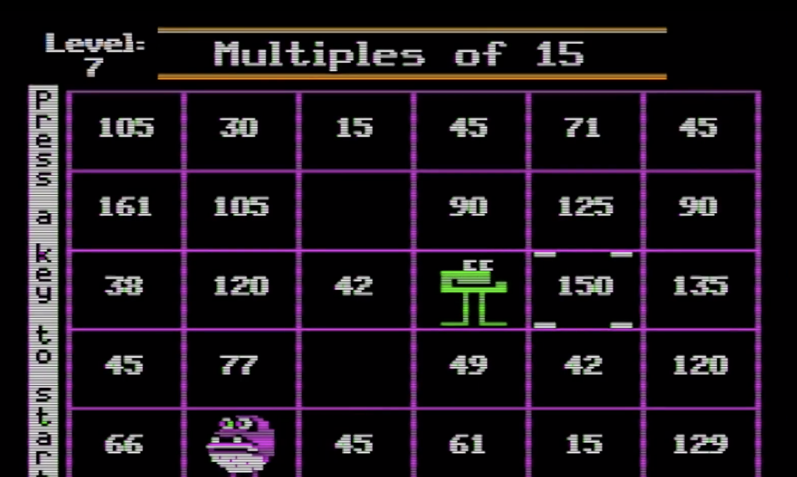
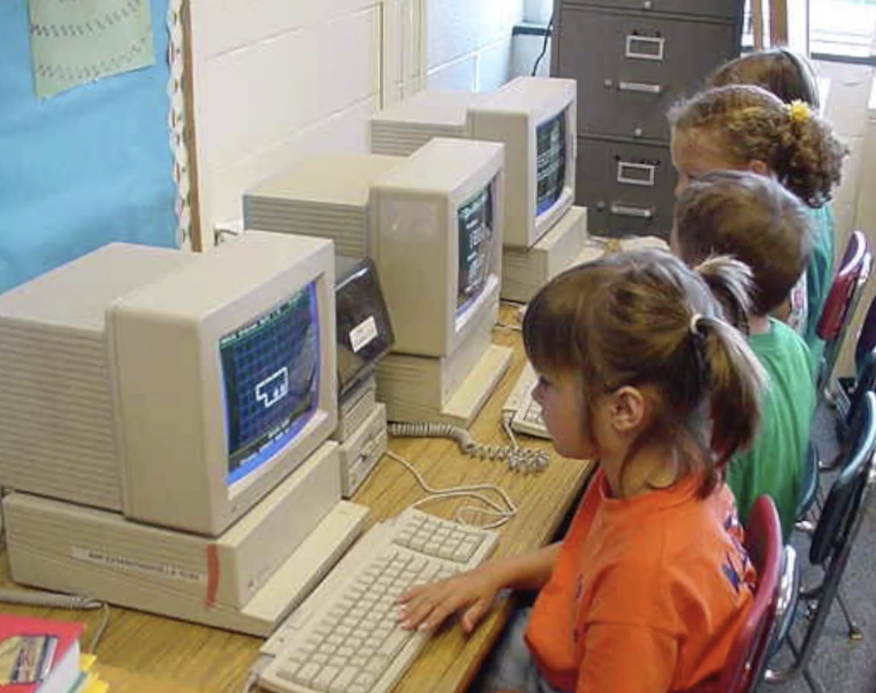
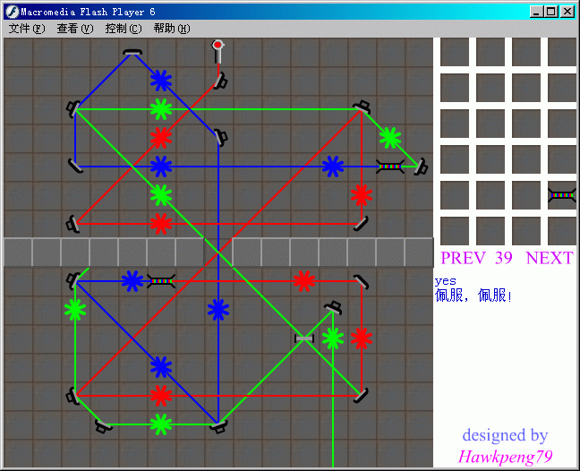

# Assignment 0

## Field 

我选择的是游戏作为「特殊教育」的作用领域。

## Application + History

教育类游戏的历史相当久远，最早可以追溯到上世纪七十年代。

苹果公司于 1977 年推出的第一部成功的个人电脑产品线 Apple II（即「Apple ][」）就广泛地被应用于教育之中。

事实上，教育行业或许是游戏最先涉足的领域之一，因为在那个软硬件资源都极度受限的年代里，计算机还没有办法提供较好的视听娱乐体验。

然而，教育类游戏通常不需要华丽的画面和复杂的运算；且具有较强的目的性，相对其他游戏容易开发。

> Apple II 上的一个数学游戏。

因此，大量的早教类游戏卡带被生产并随机器绑定销售到各所中小学校园里去。Apple II 的软件库如此之多，以至于直到 20 世纪末，Apple 都还在新机器上为 Apple II 系列软件提供向下兼容。

而等到计算机辅助早教的风潮传到中国的时候，也就是 20 世纪末期，PC 机的发展势头正旺，OS 的概念也趋于成熟；而早期的 8 位机逐渐退出了市场主流。

此时软件开发的门槛已经相当低下，早教软件的分发也不再借助于卡带、软盘等高成本媒介，而是通过信息密度更高的光盘来完成。

在当时，最流行的网页设计、交互制作和游戏制作的开发工具就是大名鼎鼎的「Flash」。在卖身 Adobe 之前，正是 Macromedia Flash 的人生巅峰；它可以通过非常俭省的空间占用轻松实现大量动画，还能实现非常复杂的交互。

早期大部分的早教游戏都是基于 Flash 开发的。

> 一个 Flash 开发的光线反射类游戏。

而後来，随着 Flash 的衰落、互联网 App 的兴起和由传统「一次性售卖」方式到「免费下载 + 应用程序内购卖」的盈利方式的转变，传统的「课件式」、「灌知识」、「做习题」的游戏失去了市场。

随着人类对游戏行为研究的不断深入，教育类游戏作为严肃游戏的一个分支开始被更认真地对待。现在，开发一款教育游戏不仅需要游戏设计师，还需要教育专家、儿童专家等多方面支持与协助，才能确保这类教育类游戏最大化的作用。

有一些游戏专门为一些特殊儿童所设计。例如，发育迟缓、感统失调、学习障碍、孤独症、脑瘫等等的儿童很难和其他儿童一样接受普通教育。但是，经过精心设计的游戏可以帮助他们以特别的方式进行学习和交流，甚至能帮助他们融入人群。

## Targets

这里，以面向孤独症患者的游戏治疗为例。

孤独症早在 1943 年就被发现，但迄今为止，其成因、致病原理、以及治疗方法都还不清楚。目前，唯一可能有效的治疗方法就是通过教育和训练的方法改善患者病情。

然而，进行教育和训练需要专业的指导和服务，大部分人都没有进行孤独症介入和治疗的能力；而专业的人工服务价格不菲。

弗吉尼亚大学教授 Micah Mazurek 试图通过计算机游戏来辅助治疗自闭症，主要原因是患者对于机械性、重复性事物具有浓厚兴趣。如果能够将这种兴趣引导到教育之中，或许能够起到更好的作用。

遗憾的是，开发这类游戏并非易事。这类游戏不能简单照搬已有的游戏模式。为了实现游戏治疗效果，游戏开发者必须和疾病学家、神经科学家等严肃人士协同工作：因为设计糟糕、缺乏维护的游戏甚至可能导致病情的恶化。

而这类游戏效果的优劣，目前没有标准来衡量。目前可以在苹果 App Store 中找到的「自闭症辅助」程序，大部分都是患儿家属竭尽所能自行开发的。然而，其中大部分质量都非常低。

## Reasoning

还是以面向孤独症患者的游戏治疗为例。

发挥作用的部分主要是电子游戏的如下特征：机械性和重复性。而且，需要玩家的专注力和快速反应的能力。这种特征正好契合患儿的兴趣偏好，因此可以以此为基础来设计干预措施。

其中，绝对的「机械性」是游戏所特有的特征。尽管电子游戏试图模拟真实世界，但总还是脱离不开程式码的基础。受过专业训练的自闭症患者介入师也必须保证在介入过程中保持理性、一致，避免个人情感的偏向流露。而这对计算机来说更容易做到。

## Pros + Cons

还是以面向孤独症患者的游戏治疗为例。

### Advantages

* 作为心理介入的措施而言，游戏成本相较于人工的成本低廉；

* 效果稳定，因为发布後的程序不会轻易被修改；

* 受环境制约相对较小，只需要一台普通计算机或家用主机就能运行。

### Disadvantages

* 容易产生沉迷。目前进行的试验中，大部分患儿都出现了沉迷游戏的倾向；
* 开发复杂。要开发出适用于特定病症患儿的游戏需要专业素养支持和大量测试；
* 良莠不齐。目前没有一个统一的标准来衡量其治疗效果，大部分无用程序充斥 App Store。

## Thoughts

游戏是有意义的。只是提供娱乐、快感，或者是通过互联网让人们连接游玩，这都是有意义的。大部分正常人都可以通过其他替代方式来获取这种快乐。可以通过各种替代方式进行交流。但是，对于有特殊障碍的人来说，隔层纱的游戏世界显得更安全、更有道理，更容易让他们获得快乐、或者学到知识。

在目前的电子产品中，「无障碍」功能已经随处可见，视障、听障患者都能借助这项功能来使用智能设备。那么，面向这些特殊障碍者的无障碍游戏，将来也应该会有吧。

## References

* [0] [Apple II, old computers](https://oldcomputers.net/appleii.html)
* [1] [Apple II in one card, The 8-Bit Guy, Episode 251](https://www.youtube.com/watch?v=tvZ43JqrvXA)
* [2] [Serious Game Simualtion, SeriousFactory](https://seriousfactory.com/serious-game-simulation/)
* [3] [Cheers Games](https://www.zhihu.com/org/qie-zi-you-xi-cheers)
* [4] [自闭症儿童走进电子课堂，通过游戏学习技能.楚天都市报](http://www.guduzheng.net/2019/06/052608267587.html)