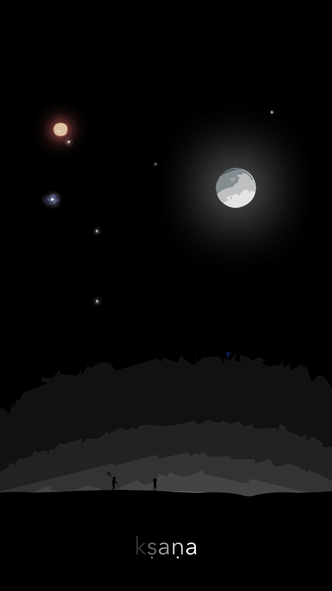
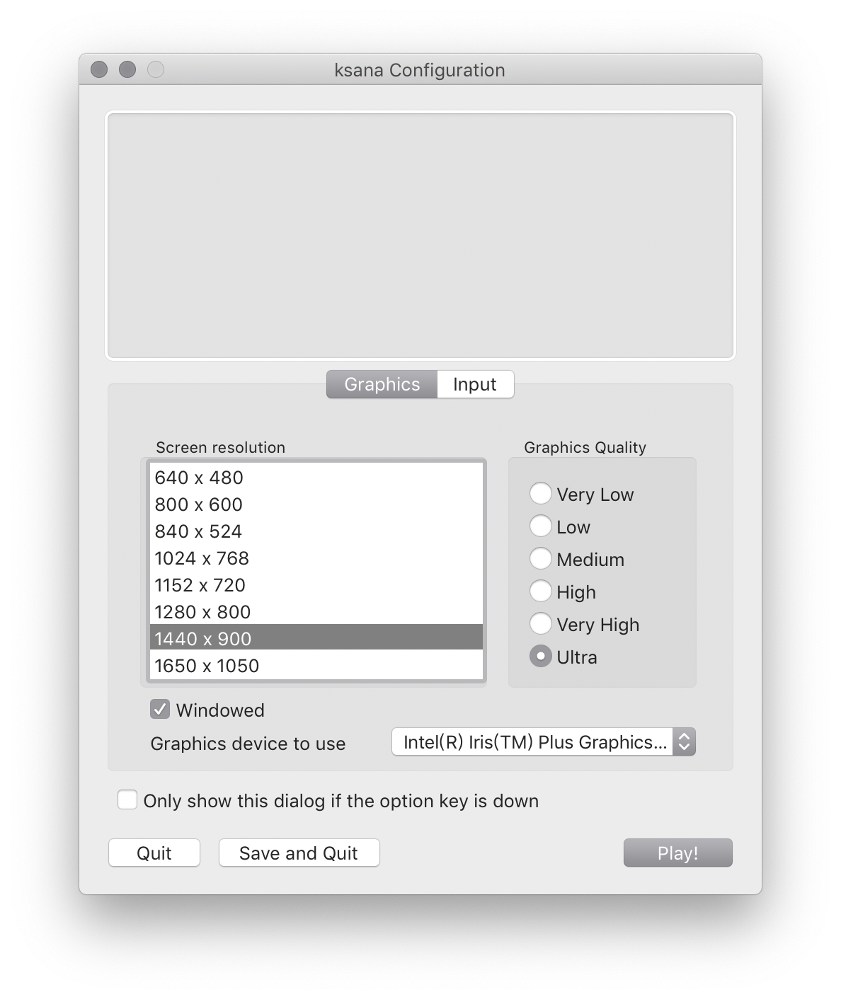
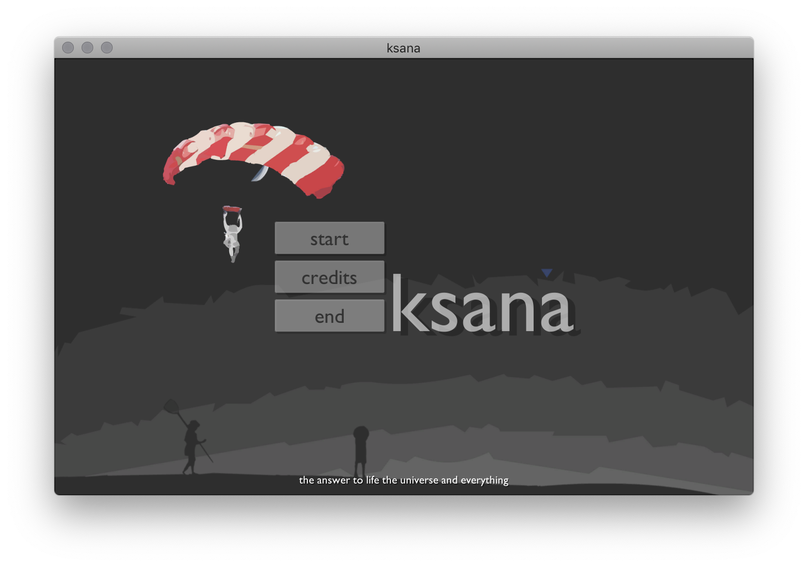
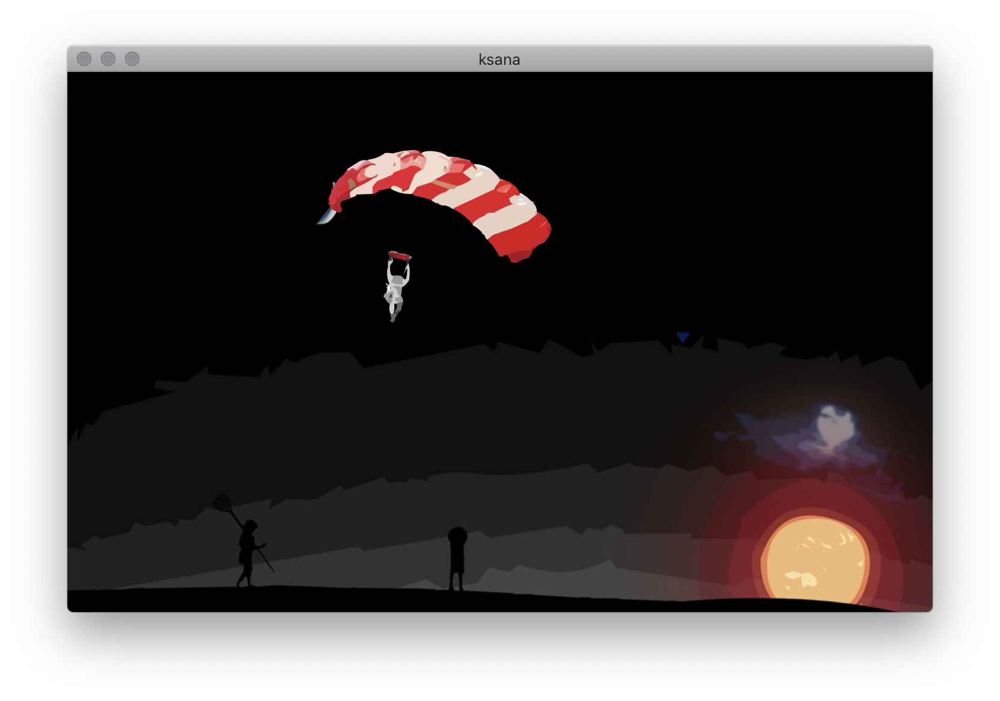
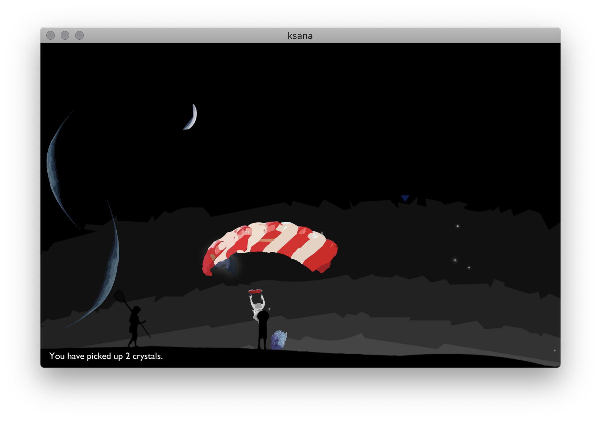
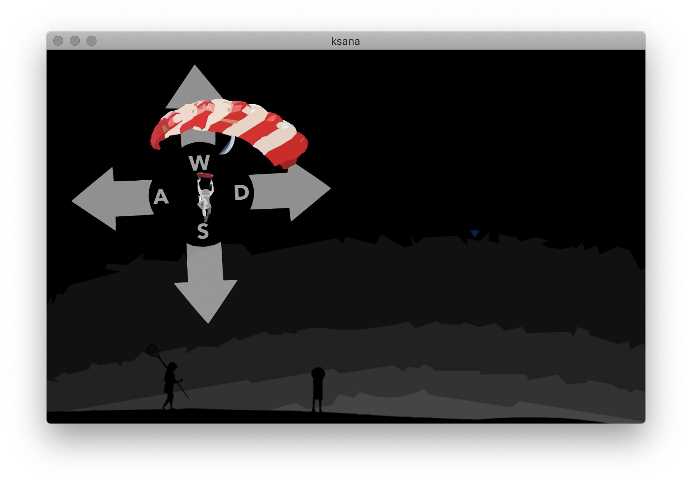
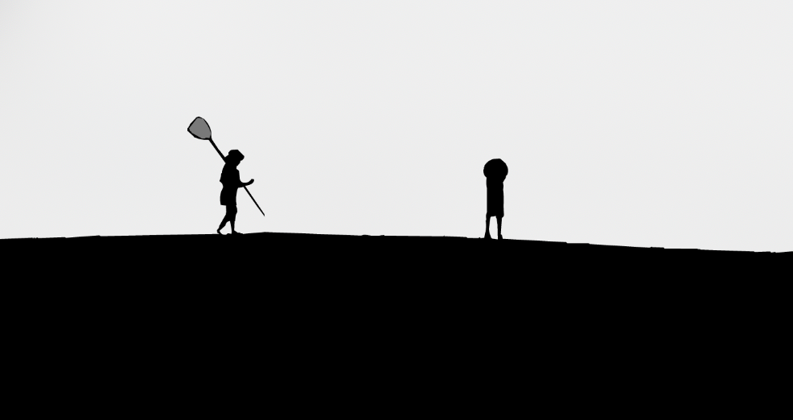

# GP Project

> Custom 2D Game

---

## 海报

## 致谢

### 图像素材

* www.nipic.com
* www.ibaotu.com
* [ishigaki-tours.com](https://ishigaki-tours.com)

> 图像素材经由 Adobe Photoshop、Apple Keynote 及 Adobe Animate 二次加工。

### 音效素材

* www.aigei.com

> 音频素材经由 Adobe Audition 二次加工。

### 音乐素材

* SOUNDORBIS - 夢の中ならば
* SOUNDORBIS - Ame Neko

> 按照 www.soundorbis.net 的许可协议使用。（[利用規約](https://www.**soundorbis**.net/**license**)）未作二次加工。

##游戏玩法 

### 配置界面

在运行游戏前，请先选择分辨率和画面质量，然后点按 `Play!` 按钮开始游戏。

### 游戏主画面

> 动态标题画面。

点按 `start` 按钮来开始游戏。

点按 `credits` 按钮来查看致谢文本。

点按 `end` 来结束程序。

### 游戏内

> 通过点按 `W`、`A`、`S`、`D` 按钮来移动降落伞。

> 靠近水晶来收集。

## 游戏功能

### 碰撞检测

游戏中利用碰撞检测（Collision Detection）实现了水晶收集功能和出屏检测功能。

### 物理效果

游戏中的可移动刚体会受到空气阻力的作用，其方向和速度方向 $v$ 相反，且阻力大小和 $v^2$ 成正比。

游戏中的红色星球会按照万有引力定律和玩家相互吸引，其引力大小和 $\dfrac 1 {d^2}$ 成正比。

游戏中的蓝色星球会按照库伦定律和玩家相互排斥，其斥力大小和 $\dfrac 1 {d^2}$ 成正比。

### UI

游戏中的 UI 通过三个 Canvas 实现，分别负责标题画面、致谢文本、水晶收集统计文本的显示。

进入游戏後的操作提示 UI 是通过 Sprite 实现的。

> 操作说明 UI。

### 音效

在靠近水晶时，应当能听到水晶破碎的声音。

标题画面和游戏内拥有不同的环境音乐。

> 均由 SOUNDORBIS 作曲。

### 精灵动画

玩家可操作的元素，即乘坐红色降落伞的人类随风飘动的动画是通过精灵动画实现的。

水晶碎裂时的动画也是通过精灵动画实现的。

另外，偶尔出现在画面中的太空碎屑飘散效果也用到了精灵动画。

### 视差滚动

游戏画面在 $z$ 轴上分为四层，具有不同的 $z$ 轴深度，因此会在摄像机抖动时产生视差效果。

#### 第一层

即最靠近摄影机的一层，作为前景出现在画面中。玩家不可与之交互。

#### 第二层

是玩家、蓝色星球、红色星球、以及水晶出现的层级。

玩家可与他们交互。

#### 第三层

是巨星轮廓、云影、星辰和碎屑出现的层级。

玩家不可与之交互。

#### 第四层

装饰性光晕、月牙所在的背景层。

玩家不可与之交互。

### 随机生成内容

游戏中出现的可交互元素、不可交互元素均属代码随机生成，且可独立调整其生成参数，包括：

* 出生频率
* 初始缩放比例
* 初始基准线速度
* 初始基准角速度
* 初始位置
* 星体质量（在计算引力时会被用到）
* 星体电荷量（在计算斥力时会被用到）

### 2D Lighting

这种简单的光照系统被用在生成红、蓝星体的外圈光晕上。