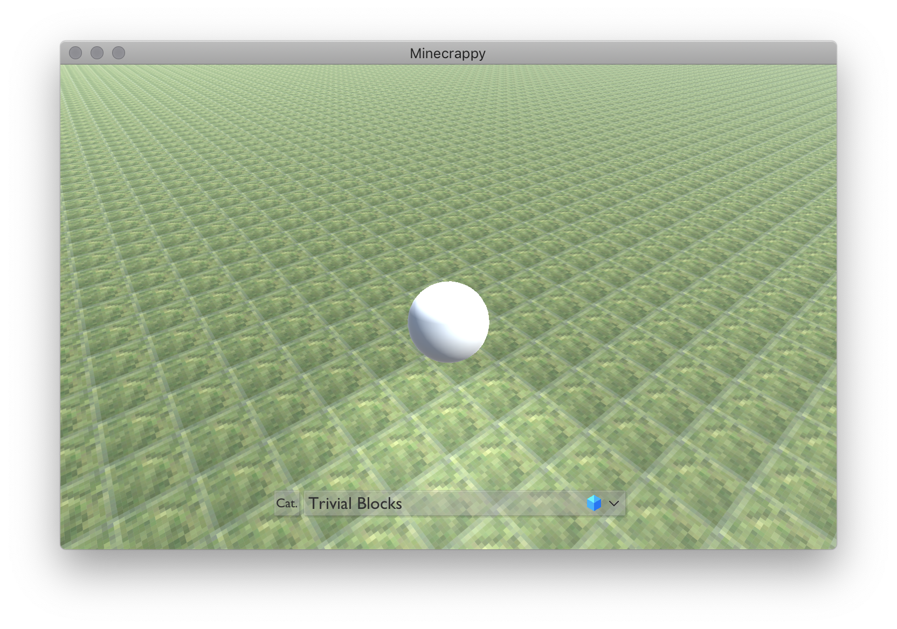
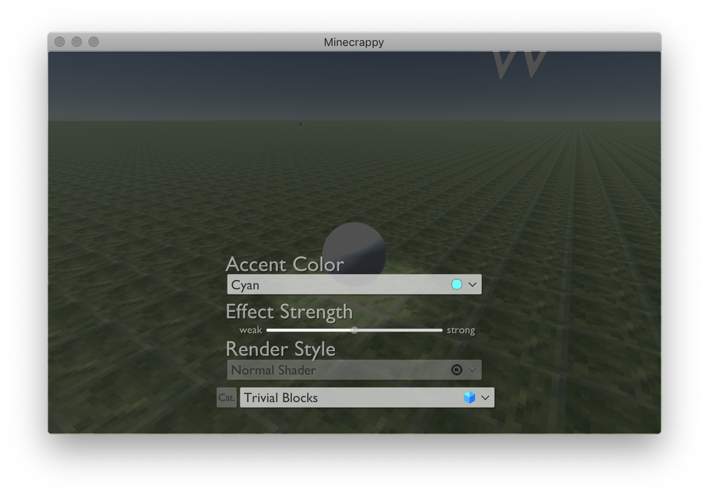
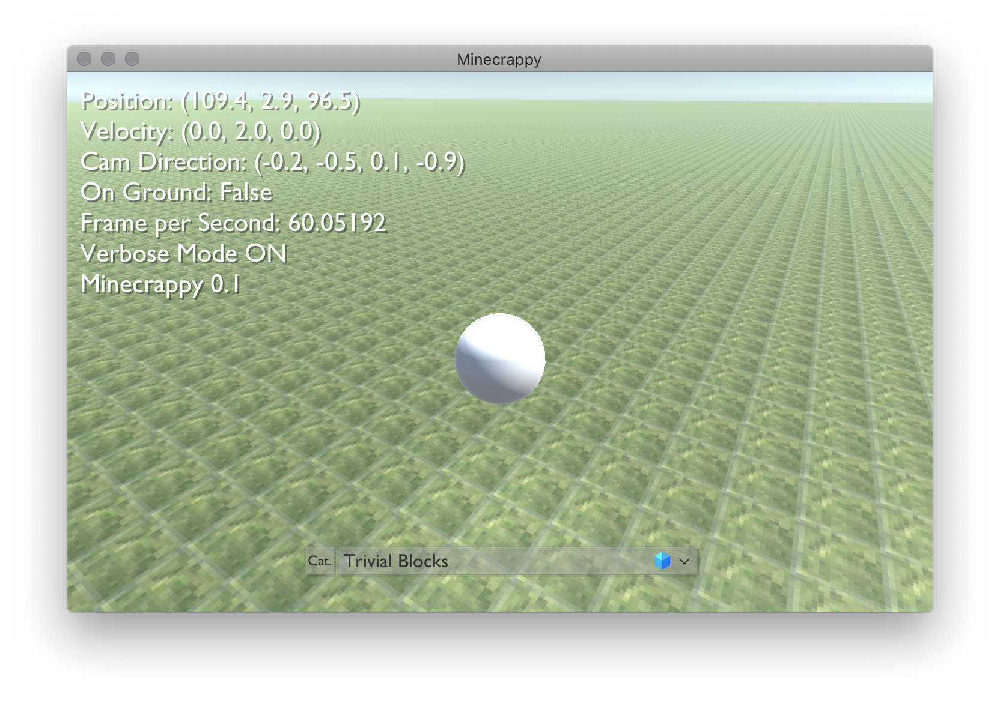
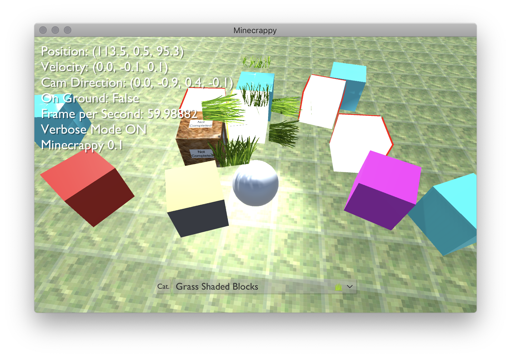

# Assignment 5

## Operation Manual

### Basic

* Press W/A/S/D to move.
* Use mouse to rotate camera.
* Press Left Shift to glide.
* Press Space to jump.

### GUI Operations

* Press E to open configuration panel.

* Press V or F3 to toggle debug mode.

### Blocks

* Press F or RMouse to spawn a new block.

## Notice

* Furry Block Shading is left unfinished currently.