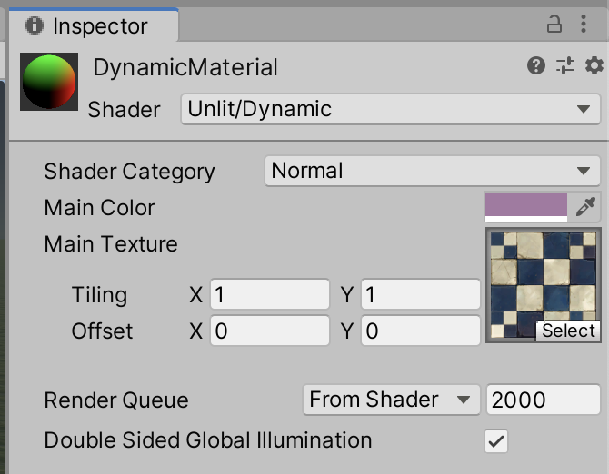
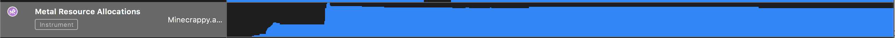

# Assignment 5

## Basic Descriptions

### ShaderGUI

参见 `./Assets/GUIShaderStuff/Dynamic.shader` 和 `./Assets/Scripts/CustomShaderGUI.cs`。

这个自定义的 Editor 支持自定义 Main Color 和 Main Texture。另外，可以根据定义宏 `USE_TRIVIAL`、`USE_NORMAL`、`USE_TEXTURE` 与否，进行不同的渲染。

> 纯色着色

> 法线着色

> 贴图着色

### In-Game GUI

游戏内的设置高光颜色、镜面高光系数的 GUI 采用 UnityUI 的 Slider 和 Dropdown 控件实现。

参见 `./Assets/Scripts/ConfigController.cs`。

里面的「普通着色」、「法线着色」、「贴图着色」三种着色方式，利用了上面的 `ShaderGUI` 实现。

> 选择 Block 着色类型

> 调整参数

其余的着色方式由于差别太大、共性太少，因此采用独立 Shader 的方式实现。

### Other Shaders

#### Outline Shader

描边 Shader 的实现方式比较简单：首先，用纯白色绘制原始图形，然后，用目标颜色以稍大的缩放比例重绘一次，即可实现粗略的描边效果。

注意：如果整体将所有面放大，那么将会完全包裹内层面，导致观察不到任何效果。因此在第二次绘制描边时，应该使用 `CULL FRONT` 来去除靠近视点的所有前面，以免遮挡内层面。

> 比较窄的描边

要更改描边强度，只要改变顶点缩放的比例即可。

> 比较重的描边

#### Wave Shader

> 效果

采用一张带透明通道的深度贴图来模拟水波的起伏，像这样：

中间那一道落差很大的横线代表浪头。

然後，用一个正弦函数来模拟浪的起伏，并随着时间移动这张循环的贴图，模拟波浪前进的效果。

最後，为了增加真实感，叠加一噪声贴图于其上。

## Debug Descriptions

这里，采用 Instruments 来 Debug 本游戏。

### General Debugging

通用的 Debug 可以采用 Activity Monitor。

可以观察到的信息包括：

游戏运行时所占用的 CPU 时间，以及对能耗的影响。

这是非常粗略的调试信息，也无法查看关于画面渲染得更多信息，因此基本只能用于很基础的调试。

### Metal Application

由于采用了 Mac 版本的 Minecrappy 进行调试，因此不能使用预设的 Core Animations 模板（适用于 iOS 的调试模板）。

在录制後可以分析如下数据：

#### GPU

此栏可以看到运行时的 GPU 占用率，以图形方式直观表述。

#### Display

此栏可以观察被渲染到显示设备每一帧的精确时间和单帧渲染耗时。

经过简单的计算可以算出最高、最低、平均帧速率，以及发现并确认极端情况下的渲染问题。

#### Metal Resource Allocations

此栏可以看到 App 对广义 Metal 资源的占用情况。

另外，可以看到程序内各独立模块的资源占用情况。

经过分析，可以发现大约 25.8% 的资源都被花在了 `ReceiveNextEventCommon` 函数上；这个函数的作用是获取来自外部的中断事件，在游戏中表现为用户操作的获取。

#### CPU

在这几栏中可以看到 App 对多核心的支持情况。可以看到 Unity 引擎开发的游戏对于多核心的支持还是比较好的，基本做到了平摊负载的目标。

