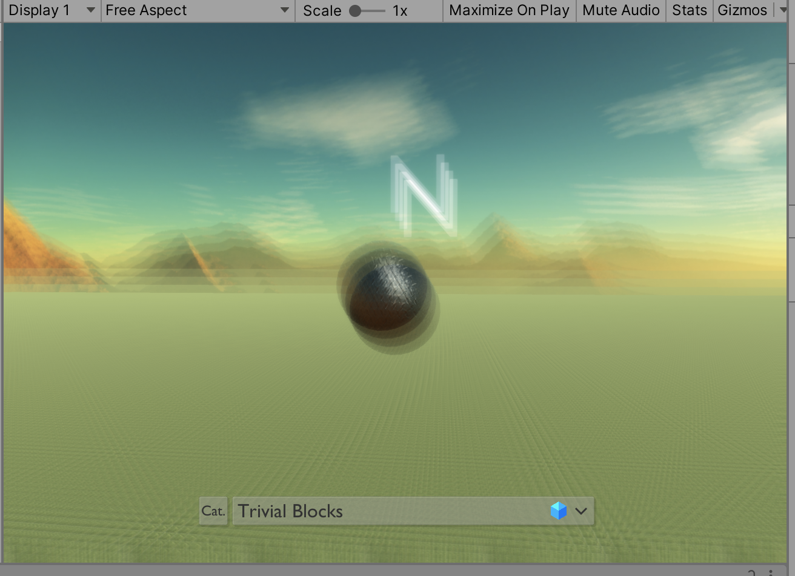

# Assignment 6

## Bidirectional Reflectance Distribution Function

### Implementations

没有太多的代码需要写。

#### Distribution Term

根据
$$
D_{GGX} = \dfrac {\alpha^2} {\pi((n·h)^2(\alpha^2 - 1) + 1) ^2}
$$
可以写出代码

```glsl
pow(roughness, 2.0) / (UNITY_PI * pow( pow(NdotH, 2.0) * (pow(roughness, 2.0) - 1) + 1, 2));
```

注意这里不能使用 C# 标准库中的 `System.Math.Pow` 进行幂指数运算，而要采用 Unity Shader 语言中预定义的 `pow` 函数。

#### Fresnel Term

根据 Schilick 模型的修正，我们需要通过
$$
F_{Schlick} = C_{spec} + (1 - C_{spec})(1 - l·h)^5
$$
进行计算。为了方便地得到反射光颜色 $C_{spec}$ 和 $1 - l·h$，我们可以通过调用内置 `DiffuseAndSpecularFromMetallic` 函数来简化代码。这个函数的前两个参数是传入参数，和 `Schlick_F` 的两个参数对应；而後两个参数是传出参数，调用後会将值存入其中。

得到 `specColor` 和 `oneMinusReclectivity` 之後就直接返回就好了。

```glsl
specColor + (1 - specColor) * oneMinusReflectivity;
```

#### Geometry Term

Cook-Torrance 告诉我们，几何系数
$$
G_{Cook - Torrance} = \min\lbrace 1, \dfrac {2(n·h)(n·v)} {v·h}, \dfrac {2(n·h)(n·l)} {v·h}\rbrace
$$
式中的 $n·l$、$n·v$、$v·h$、$n·h$ 都作为参数给出了。因此只需要做简单的乘除法及比较即可返回结果。

同样地，这里不能使用 `System.Math.Min`，而要使用 Unity Shader 提供的 `min`。

#### Finale

最後，在 Fragment Shader 末尾将除错代码注释掉，并将最终计算的颜色向量返回即可得到结果。

### Results

#### Demo


> 注：调整了摄像机位置为 `(20, 20, 50)`，角度为 `(0, 0, 0)`。

#### In-Game

将上面的天空盒和 BRDF 效果应用到 `Minecrappy` 游戏中，得到的效果如下：


## Unrealistic Rendering

### Hatching Effect

#### Resources


首先，把模拟笔触的六张贴图摸下来。

#### Main Idea

本质上，我们只需要把这六种层次深度的贴图糊到模型上就可以了。

但是，按照什么标准来决定贴图的深浅呢？

通过观察实际的素描绘画效果，可以发现深浅大致和物体点的亮度有关。而且，亮暗存在很明显的层级差异。


这样，我们只需要计算正常渲染时每个片元的漫反射亮度（Unity 提供了 `WorldSpaceLightDir` 函数进行计算），将其归一化之後选择一个亮度层级的 Hatching 贴图贴上去即可。

#### Coding

参见 `./Assets/Shader/HatchingShader.shader`。

#### Issues

这种计算方法静态看还好，但是在光照变化强烈的时候（或者说视角变换的时候）会产生很不连续的视觉效果。


（而且，和下面的景深效果之间不是很友好。）

> 题外话：这种渲染风格总让我想起恐怖游戏「Neverending Nightmares」…

## Post Processing

### Blur Effect

#### Basic Idea

这里只采用最简单的实现。

首先，我们要将 Camera 的 `depthTextureMode` 位设定为开，保证传输的数据中包含深度信息。

然後，我们需要计算每个 Fragment 所对应的模糊程度。

这里，模糊系数采用 `saturate(abs(distance - focalDistance))` 计算，即实际距离和摄像机焦距的绝对值差值，再进行归一化。

按照物理规律，摄像机在拍摄与其距离恰好等于焦距的物体时最清楚，而过近或过远的物体都会比较模糊。而且，离眼较近的物体产生的模糊效果更为明显。因此，先对视差距离取对数，归一化，再取对数并取绝对值。这样，就能保证落在焦距内物体内的的模糊程度强于超出焦距物体的模糊程度。

在得到模糊系数之後，以此对 Fragment 加入 Blur Effect 即可。

#### Coding

参见 `./Assets/Scripts/DepthOfFieldController.cs` 和 `./Assets/Shaders/CameraDepthShader.shader`。

#### Preview


#### Appliance

由于这种景深实现的效率十分感人（每秒渲染帧数掉到 $20$ 以下），因此在应用到实际游戏中时，直接用了 Unity PostProcessing 库来代替这一糟糕实现。


### Foggy Effect

雾化效果。

#### Basic Idea

实际上，「雾化」效果和动态模糊效果十分类似。

只不过，模糊效果是按照「物体离摄影机焦点的距离」对其施加模糊效果；而雾化效果则是按照「物体离摄影机（视觉主体）的距离」将物体颜色同预定义的「雾」颜色进行混合，且越远的物体混合不透明度越高，从而模拟出体积雾的效果。

#### Strategies

主要策略的不同在于：如何确定距离和混合透明度的函数关系。常用的策略包括：

* Linear（线性雾）
  * 距离和混合不透明度构成线性关系。
  * 物体的淡入淡出效果比较自然。
* Exponent（指数雾）
  * 随着距离增加，混合不透明度指数增长。
  * 这种雾比起线性雾来说增加得更迅速，因此通常会显得场景更深些。
* Exponent²（指数平方雾）
  * 本质上也是指数雾，因为 $(a^x)^2 = (a^2)^x$；只不过底数更大一些罢了。

游戏中的场景相当广阔，因此采用线性雾（Linear）的方式进行实现。

#### Coding

参见 `./Assets/Scripts/CameraFoggyController.cs` 和 `./Assets/Shader/FoggyShader.shader`。

#### Results


### Motion Blur Effect

动态模糊效果。

#### Basic Idea

这个效果同样按照深度纹理进行采样，并以此计算出该物体相对于摄像机的运动速度。

接着，对该方向进行多次采样（这里采用 4 次），并求出像素的平均值作为结果。且，越靠後的采样像素值效果越高。

这种策略对于摄像机平移的效果较好；但对摄像机旋转的效果不好，会产生很不平滑的抖动。主要原因是视觉中心是以摄像机为准的，但在视角旋转时，摄像机本身是在绕着被摄主体快速转动，因此看起来很不自然。

#### Coding

参见 `./Assets/Scripts/MotionBlurController.cs` 和 `./Assets/Shader/MotionBlurShader.shader`。

#### Results



## Minecrappy v0.2

### What's New

* 更新了主角（一个球）的材质。现在使用 BRDF^TM^ 技术渲染！
* 增加了卡通高光方块、素描方块。
* 增加了可选的雾化效果、景深效果、和动态模糊效果。
* 支援手柄操作。

### Control

#### Keyboard + Mouse

* 按「W/A/S/D 键」来向前、後、左、右移动。

* 移动鼠标来调整视野。

* 按住「左 Shift 键」来飞行。与此同时按住方向键来滑翔。
* 站在刚体上时，按「Space 键」来跳跃。
* 按「E 键」来开/关方块配置面板。
* 按「V 键」或「F3 键」来开/关侦错面板。
* 按「F 键」或「鼠标右键」来放置方块。
* 按「P 键」来开/关景深效果。
* 按「O 键」来开/关雾化效果。
* 按「B 键」来开/关动态模糊效果。

#### Xbox Joystick Controllers

* 滚动「左摇杆」来移动主角。
* 滚动「右摇杆」来调整视野。
* 按住「B 键」来飞行。与此同时滚动左摇杆来滑翔。
* 站在刚体上时，按「X 键」来跳跃。
* 按「Menu 键」来开/关方块配置面板。
* 按「Y 键」来开/关侦错面板。
* 按「A 键」来放置方块。
* 按「RB 键」来开/关景深效果。
* 按「LB 键」来开/关雾化效果。
* 按「右摇杆」来开/关动态模糊效果。

#### Dualshock Joystick Controllers

* 滚动「左摇杆」来移动主角。
* 滚动「右摇杆」来调整视野。
* 按住「○ 键」来飞行。与此同时滚动左摇杆来滑翔。
* 站在刚体上时，按「□ 键」来跳跃。
* 按「OPTIONS 键」来开/关方块配置面板。
* 按「△ 键」来开/关侦错面板。
* 按「✕ 键」来放置方块。
* 按「R1 键」来开/关景深效果。
* 按「L1 键」来开/关雾化效果。
* 按「R3」来开/关动态模糊效果。


