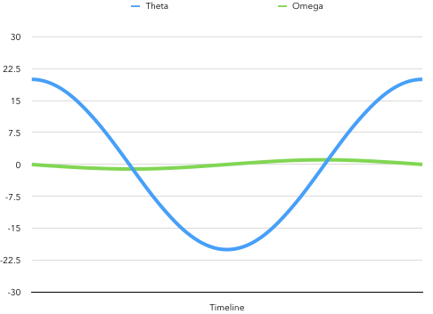
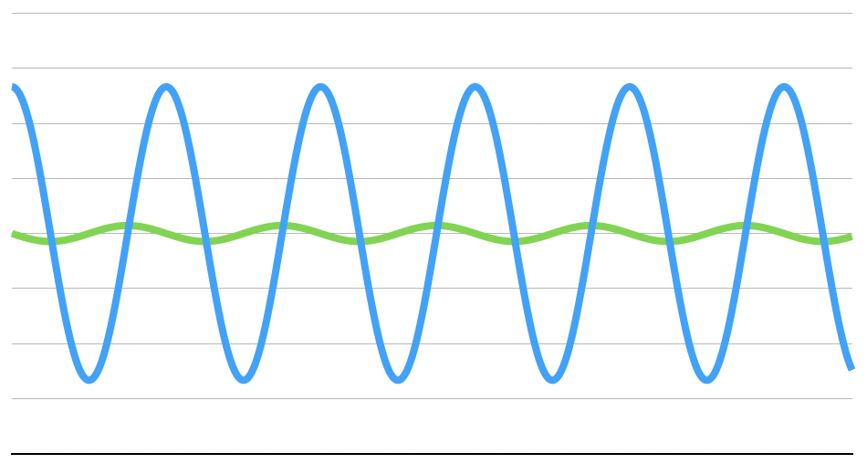
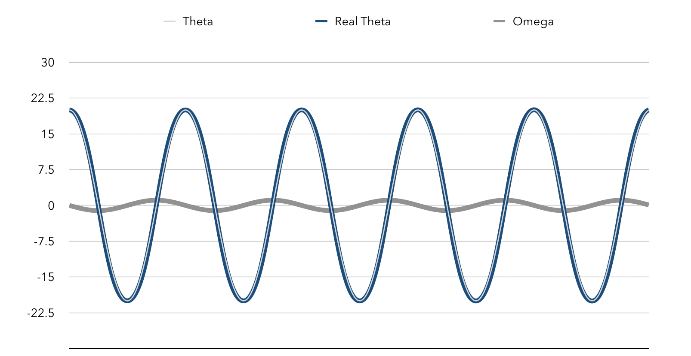
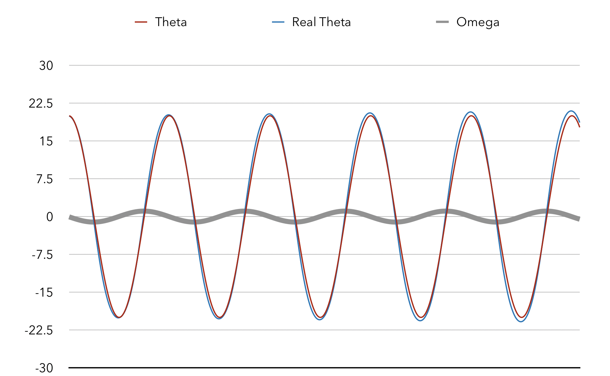
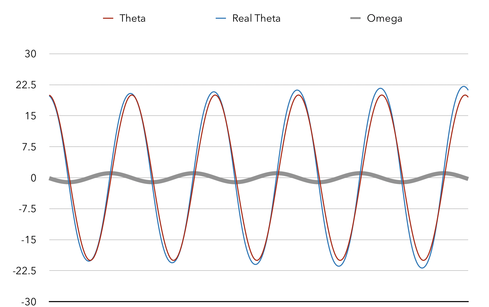
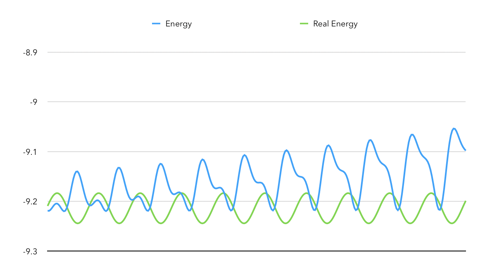

# Assignment 7

## Game Physics

### Pendulum Simulation

#### Base

首先，可以利用已经给出的简化型微分方程公式简单地进行数值模拟得到结果。

```python
while True:
    current_time += time_elapse
    theta += omega * time_elapse
    omega -= world_g / length * sin(theta) * time_elapse
```

> 参见 `./Simulation/simulate_benchmark.py`。

代码很简单：每经过一段 `time_elapse`，就按照公式及 $n$ 回时的数据更新 $n + 1$ 时对应的 $\theta$ 和 $\omega$。

显然，`time_elapse` 选择得越小，模拟的结果越接近微分方程的解。这里取 `time_elapse` 为 $0.001$（即 $1$ 毫秒更新一次），得到基准模拟结果，为後续作参照。



> 参见 `./Simulation/benchmark.csv`。

可以看到，其周期性良好。



#### Benchmark

##### Mathematics

首先，我们构建一个基准函数：不通过微分方程模拟的方式计算摆球的位置，而是通过
$$
\left\{  
             \begin{array}{**lr**}  
             x = x_0 + L\sin\theta &  \\  
             y = y_0 + L\cos\theta &    
             \end{array}  
\right.
$$
计算位置。这种计算方式能始终保证 $\theta$ 和 $(x, y)$ 的一致性。可以作为我们摆球的参照标准。

##### Simulating

参见 `./Simulation/simulate_benchmark.py`。

##### Implementation


#### Explicit Euler's

##### Mathematics

$$
x(t_0 + h) = x_0 + hf(x_0)
$$

这里，我们直接采用
$$
\left\{  
             \begin{array}{**lr**}  
             \Delta x = \omega R \cos\theta \Delta t &  \\  
             \Delta y = \omega R \sin\theta \Delta t &    
             \end{array}  
\right.
$$
来步进计算其位置移动。这时就可能出现 $\theta$ 和 $\arctan \dfrac {x - x_0} {y - y_0}$ 不一致的现象。将 $\omega$、$\theta$、$\theta'$ 进行模拟，得到结果如下：



看起来还不错？那是因为现在的采样频率是 $1$ 毫秒一次。如此密集的采样基本不会带来任何误差。

让我们把采样频率降低到 $16$ 毫秒一次，这大概是每秒渲染 $60$ 帧画面的采样频率。



此时可以明显看到误差了。

而每秒 $30$ 次采样的结果就更差了，且有随着时间扩大的趋势：



更奇怪的是，如果我们仔细观察，会发现欧拉法算出的 $\theta$ 峰值逐渐增大！

选取单摆锚点为零势能点，可以算出系统总机械能为
$$
E = -mgL \cos \theta + \dfrac 1 2 m \omega ^2 L^2
$$
那么令摆球的质量为单位质量，忽略摆的自重，可以画出系统的机械能和时间的图像：



> 注意因为我们选取的零势能点相对较高，系统的机械能呈现为负值。单位是 Joule。

根据欧拉法模拟的单摆系统居然无中生有，逐渐增大了机械能。

这实在太可疑了。

##### Simulating

参见 `./Simulation/simulate_euler.py`。

##### Implementation

