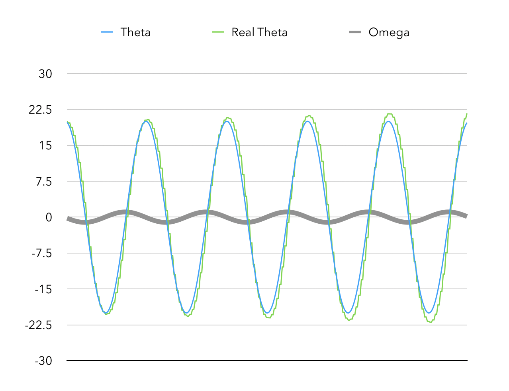

# Assignment 7

## Game Physics

### Pendulum Simulation

#### Motion Equations

首先，可以利用已经给出的简化型微分方程公式简单地进行数值模拟得到结果。

```python
while True:
    current_time += time_elapse
    theta += omega * time_elapse
    omega -= world_g / length * sin(theta) * time_elapse
```

> 参见 `./Simulation/simulate_benchmark.py`。

代码很简单：每经过一段 `time_elapse`，就按照公式及 $n$ 回时的数据更新 $n + 1$ 时对应的 $\theta$ 和 $\omega$。

显然，`time_elapse` 选择得越小，模拟的结果越接近微分方程的解。这里取 `time_elapse` 为 $0.001$（即 $1$ 毫秒更新一次），得到基准模拟结果，为後续作参照。


> 参见 `./Simulation/benchmark.csv`。

可以看到，其周期性良好。


#### Benchmark

##### Mathematics

首先，我们构建一个基准函数：不通过微分方程模拟的方式计算摆球的位置，而是通过
$$
\left\{  
             \begin{array}{**lr**}  
             x = x_0 + L\sin\theta &  \\  
             y = y_0 + L\cos\theta &    
             \end{array}  
\right.
$$
计算位置。这种计算方式能始终保证 $\theta$ 和 $(x, y)$ 的一致性。可以作为我们摆球的参照标准。

##### Simulating

参见 `./Simulation/simulate_benchmark.py`。

##### Implementation


#### Explicit Euler's

##### Mathematics

$$
x(t_0 + h) = x_0 + hf(x_0)
$$

这里，我们直接采用
$$
\left\{  
             \begin{array}{**lr**}  
             \Delta x = \omega R \cos\theta \Delta t &  \\  
             \Delta y = \omega R \sin\theta \Delta t &    
             \end{array}  
\right.
$$
来步进计算其位置移动。这时就可能出现 $\theta$ 和 $\arctan \dfrac {x - x_0} {y - y_0}$ 不一致的现象。将 $\omega$、$\theta$、$\theta'$ 进行模拟，得到结果如下：


看起来还不错？那是因为现在的采样频率是 $1$ 毫秒一次。如此密集的采样基本不会带来任何误差。

让我们把采样频率降低到 $16$ 毫秒一次，这大概是每秒渲染 $60$ 帧画面的采样频率。


此时可以明显看到误差了。

而每秒 $30$ 次采样的结果就更差了，且有随着时间扩大的趋势：


更奇怪的是，如果我们仔细观察，会发现欧拉法算出的 $\theta$ 峰值逐渐增大！

选取单摆锚点为零势能点，可以算出系统总机械能为
$$
E = -mgL \cos \theta + \dfrac 1 2 m \omega ^2 L^2
$$
那么令摆球的质量为单位质量，忽略摆的自重，可以画出系统的机械能和时间的图像：


> 注意因为我们选取的零势能点相对较高，系统的机械能呈现为负值。单位是 Joule。

根据欧拉法模拟的单摆系统居然无中生有，逐渐增大了机械能。

这实在太可疑了。

##### Simulating

参见 `./Simulation/simulate_euler.py`。

##### Implementation


#### Midpoint

##### Mathematics

我们知道 Euler 法的问题在于采用 $t_0$ 时刻的 $f(t_0)$ 代替 $[t_0, t_0 + \Delta t]$ 内的斜率，而大部分情况下这会带来偏差：$f(t)$ 增大时跟不上，$f(t)$ 减小时又刹不住。

显然，更好的办法是采用 $t_0 + \dfrac {\Delta t} 2$ 时刻的 $f(t)$ 代替 $[t_0, t_0 + \Delta t]$ 内的斜率，至少这样不会产生那么明显的 Bias 了。

这里无法很好地精确算出两次采样中点处的 $f(t_0 + \dfrac {\Delta t} 2)$，所以只好勉为其难地采样两次才进行一次步进：即 $x(t_0 + 2 \Delta t) = x(t_0) + f(t_0 + \Delta t) \times 2\Delta t$。



就此来说，几乎没有什么改进。而且还因为采样率降低了一倍，产生了很不好的锯齿。

##### Simulating

参见 `./Simulation/simulate_trapezoid.py`。

##### Implementation


#### Trapezoid

##### Mathematics

Trapezoid 方法呢，利用了一个近似，即：
$$
f(t_0 + \dfrac {\Delta t} 2) \simeq \dfrac {f(t_0) + f(t_0 + \Delta t)} {2}
$$
这样，我们就可以在不降低采样率的同时，弥补显式欧拉法的缺陷。


挺好的。

##### Simulating

参见 `./Simulation/simulate_trapezoid.py`。

##### Implementation


### Hair Simulator

#### Effects


> 一开始做出来的效果非常恶心…像一坨快速扭曲蠕动的黑色毛线。


> 稍微调整之後的效果

#### Mathematics

基本按照 Milo Yip 博客里的方法实现 Verlet 函数，即
$$
x(t + \Delta t) = x(t) + d (x(t) - x(t - \Delta t)) + a(t) \Delta t^2
$$
这个函数通过 $x(t)$ 和 $x(t - \Delta t)$ 计算出 $x(t)$，是个递推式。但是，她要求两次采样之间的 $\Delta t$ 相同，这在实际的运算中是很难做到的。因此在实际运算中，采用这个式子进行计算：
$$
x(t + \Delta t_1) = x(t) + d (x(t) - x(t - \Delta t_2)) + a(t) \Delta t_1 \Delta t_2
$$
其中 $d$ 是阻尼系数，$a$ 是瞬时加速度。

#### Coding

##### Node

首先，我们按照输入，初始化 `nodeCount` 个发丝节点。除了发根节点（第一个节点的位置）以外，其余位置均不需要给出，而是通过迭代的方式求出。

由于上面的递推式对每个节点来说，有用的信息就只有「当前位置」和「上次采样的位置」，因此只需要保存这两个向量就足够了。这就是我们的 `HairNode` 类：

```csharp
public class HairNode {
    public Vector3 position;
    public Vector3 lastPosition;
    public float length;
}
```

> 顺便保存了一下每段的长度。

##### Acceleration

然后，我们得求出瞬时加速度。很奇怪的是，`RigidBody` 类并没有给出方法让我们求出瞬时加速度（我以为既然有 `AddForce()` 那就该有个对应的 `GetForce()`），所以咱们只好搞搞近似了。

在 `FixedUpdate()` 函数中，每隔一定时间（这里采 $0.02$ 秒）就计算一下当前速度和上次采样的速度的差值，然后利用加速度的定义公式 $a = \dfrac {v - v_0} {\Delta t}$ 求出近似的瞬时加速度。

##### Verlet

相当容易实现：把公式写成代码就好了，如下：

```csharp
acceleration += new Vector3(0, -9.80665f, 0);
return position + (position - lastPosition) * damping + acceleration * deltaTime * deltaTime;
```

注意头发还受到一个额外的重力加速度 $g$。

##### Iteration

下面就要迭代地更新每根头发的位置了。主要做两件事：碰撞检测和长度限制。

碰撞检测由函数 `collideBox` 完成；她负责检查头发有没有飘到 Sphere 里头去；如果飘到了，那就把它提取到最接近的表面处。

长度限制由函数 `lengthConstraint` 完成；简单说，根据头发链表中上一节点的位置和发丝段的长度计算出下一节点的位置，以此类推。

由于一开始所有的节点位置都是未知的，因此需要进行多次碰撞检测和长度限制才能使其收敛；经过测试大概 $10$ 次比较适合。

##### Drawing

接下来要做的就是把这些头发画出来。

既然我们已经有了所有头发节点的空间位置，那么直接采用 `LineRenderer` 就能把它们画出来了。

注意每一个 `GameObject` 只能绑定一个 `LineRenderer` 组件；因此只好给每一根头发丝都创建一个 `GameObject` 负责绘画。

##### Spawning

只有一根头发怎么行？`HairSpawner` 负责创建大量的头发丝在同一个物体上。

这里，采用球面坐标系方式，遍历 $[0, \pi]$ 内的 $\theta$ 以及 $[0, 2\pi]$ 内的 $\phi$，通过
$$
\left\{  
             \begin{array}{**lr**}  
             x = R\sin\theta\cos\phi &  \\  
             y = R\sin\theta\sin\phi &  \\  
             z = R\cos\theta &    
             \end{array}  
\right.
$$
均匀遍历球面上的每一个点，加上球的自转後在对应位置安置 `HairSimulator` 发丝对象。

> 因为全球生发的效果太鬼畜，所以後来改成只在其中一个小扇面上安置头发了。

> 以上。

## What's New

* Minecrappy v0.3 更新
  * 现在可以放置自定义颜色、阻尼系数的毛发球体。
  * 东南西北四个方向，现在有四种模拟方式的单摆。
  * 支持使用 Joystick Controller 调整方块种类，只要按 L2 与 R2（Dualshock）/ LT 与 RT（Xbox）。

