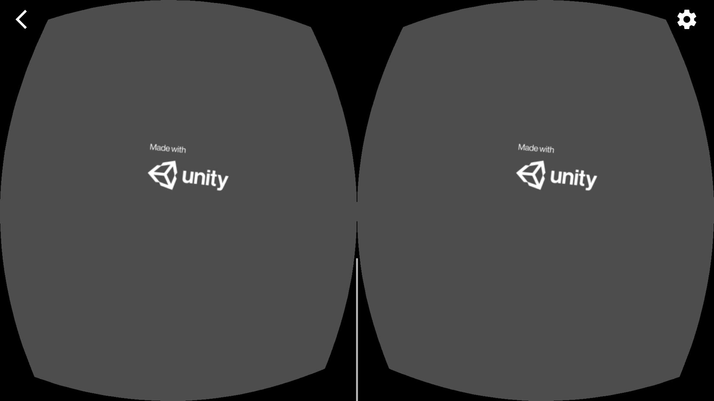

# Assignment 8

## Cardboard VR

### 游玩说明

点按 `Minecrappy` App 图标，**连接耳机**，将手机放入 Cardboard 後进入游戏画面。

> 启动画面

加载完成後，应该能看到自己处于一个圆形平台上。摇摇脑袋来看别处。

应该能看见不同样式和种类的球和方块从天上落下。

将视觉中心聚焦在下落的物块上一段时间，观察到其颜色加深；最後，物体会破碎并给予您一定的分数。

游戏内 UI 展示着游玩时间…

…您打破的物块数量…

…以及您所得到的分数。

打破物块後，新增加的分数会暂时显示在物块曾经所在的位置。

### 操作说明

只需要摇摇头，观察不同的位置就可以了。

可以点按 Cardboard 键，但是什么都不会发生。

需要带上耳机才能听到环境音和效果音。

### 其他说明

游戏内的场景音乐是 Alexandar Nakarada 所作的 *Winter*，收录于专辑 *Complete Discography* 中。

按照 Creative Commons Zero License 给予授权。

